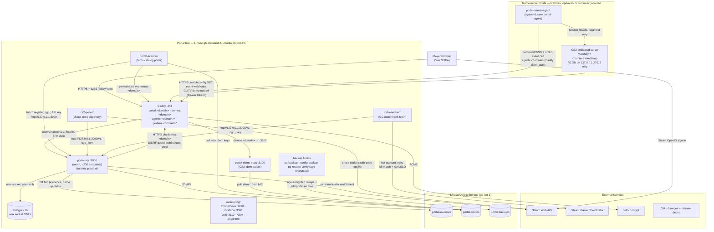
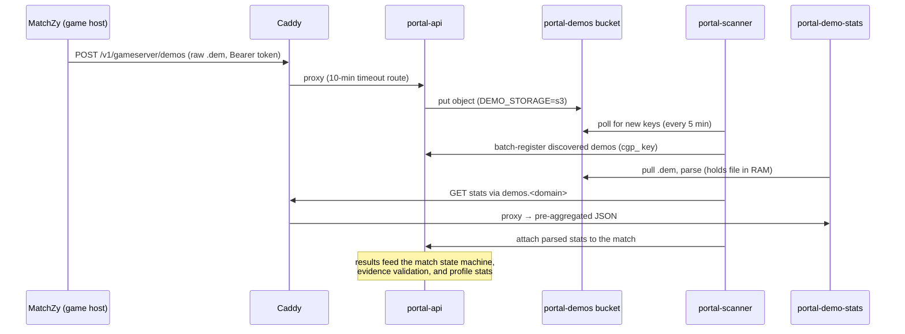
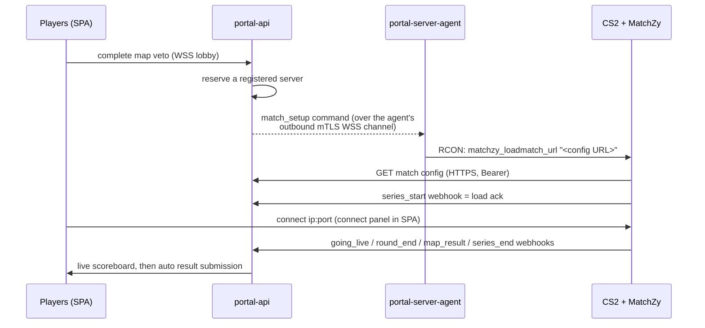
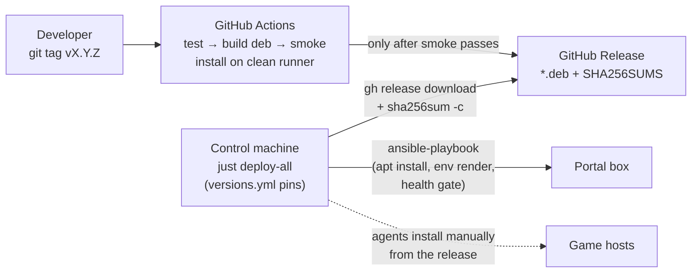

# Architecture overview

Who talks to whom, over what, and where everything runs. Companion docs:
[`matchzy-integration.md`](matchzy-integration.md) (game-server automation
design), [`observability-design.md`](observability-design.md) (metrics/
monitoring), `../deploy/README.md` (ops model), `../deploy/DEPLOY-RUNBOOK.md`
(standing a site up).

## The one-paragraph version

A **single Linode VM** ("the portal box") runs everything user-facing:
Caddy terminates TLS and fronts a Vue SPA, the Rust API, and the demo
parser; Postgres is socket-only; two opt-in Steam bots and a demo scanner
feed the match pipeline. **CS2 game servers** (any host, anywhere) are
integrated *outbound-only* — a small agent dials the portal over mTLS
WebSocket and drives the local server via RCON on localhost, so game hosts
never accept portal-initiated connections and the portal never stores RCON
passwords. **Linode Object Storage** holds evidence, demos, and encrypted
backups. Every service ships as a `.deb` from a test-gated GitHub release
and is converged by Ansible from the operator's **control machine**.

## Topology

\* = opt-in (`portal_steam_bot_enabled`, `monitoring_enabled`,
`gameserver_integration_enabled` in `deploy/ansible/group_vars/all/vars.yml`).

## Who runs where — and why

| Service | Host today | Why there | Where it could move |
|---|---|---|---|
| Caddy | portal box | one TLS/ingress point, four vhosts | stays with the API |
| portal-api (+portal-cli) | portal box | needs the Postgres socket | stays with the DB (or DB moves to a private-net Linode first) |
| Postgres 16 | portal box | socket-only = zero network surface | **first split candidate**: dedicated DB box on a private VLAN when load demands (then api.env's DATABASE_URL goes TCP + TLS) |
| portal-demo-stats | portal box | co-located is simplest; fed from S3 either way | **best split candidate**: parsing holds a whole .dem in RAM (~2 GB spikes); S3-fed, so it can run anywhere `demos.<domain>` can point |
| portal-scanner | portal box | loopback API access; tiny footprint | with the API, or with demo-stats if split |
| cs2-poller / cs2-enricher | portal box | loopback API; tiny | anywhere with HTTPS to the portal (env just needs a public PORTAL_API_URL + key) |
| monitoring stack | portal box | scrapes loopback /metrics | a second box once there is one (Prometheus can scrape over a private net or a tailnet) |
| backup timers | portal box | need the Postgres socket + /etc/portal | inseparable from the DB host |
| portal-server-agent + CS2/MatchZy | **game hosts** (never the portal box) | game servers are wherever the community runs them; integration is outbound-only by design | n/a — this is the point of the agent |
| SPA bundle | portal box (`/var/www/portal`, portal-web deb) | served by Caddy same-origin with the API → no CORS | a CDN later; the bundle is origin-agnostic (relative URLs) |

**The design rule behind the placement:** the portal box only ever
*accepts* connections on 22/80/443, and game hosts accept none from the
portal at all. Everything cross-host is either through Caddy's vhosts or
an outbound call to Steam/S3/GitHub.

## The demo pipeline (worked example)

The flow most new developers ask about first — how a match played on a
community server becomes stats on a profile page:

The same bucket also receives demos discovered by the Steam bots
(share-code route) — different producer, same consumer chain.

## Match automation (MatchZy integration)

Full contract details (webhook quirks, config format, enrollment/mTLS
model): `matchzy-integration.md` §2 and §5.

## Build & deploy path

Five repos produce the artifacts: `cg` (portal-api + portal-scanner debs),
`cg-fe` (portal-web deb + this SPA), `csgo-demo-stats`
(portal-demo-stats), `cg-steam-bot` (portal-steam-bot: both bots),
`cg-server-agent` (portal-server-agent). Tags must equal the package
version — CI refuses otherwise. Rollback = deploy the previous tag
(`allow_downgrade`); the DB never rolls back (forward-only migrations +
pre-deploy snapshots).

## Port & identity registry (portal box)

| Port | Service | Bound to | Auth |
|---|---|---|---|
| 443/80 | Caddy | public | TLS; agents vhost additionally mTLS client certs |
| 22 | sshd | public | keys only; `ops` user |
| 3000 | portal-api | loopback | JWT (users), `cgp_` API keys (services), forwarded client-cert serial (agents) |
| 3100 | portal-demo-stats | loopback | fronted by demos.<domain> |
| 5432 | Postgres | **nothing** (socket only) | peer auth (`portal`, `postgres` unix users) |
| 9090/3001/3110 | Prometheus / Grafana / Loki | loopback | Grafana behind vhost or tailnet |
| 9100/9187 | node/postgres exporters | loopback | scrape-only |
| 9464–9468 | service /metrics (api, scanner, demo-stats, poller, enricher) | loopback | none (loopback) |
| 9469 | agent /metrics (game hosts, local diagnostics) | loopback there | never scraped by the portal |

Unix users on the box: `portal` (api, scanner, demo-stats, bots — shared),
`postgres` (DB + backup dumps), `caddy`, `ops` (operator SSH), plus
`portal-agent` on game hosts. Secrets live in `/etc/portal/*.env`
(root:portal 0640), rendered from the Ansible vault on every converge.
