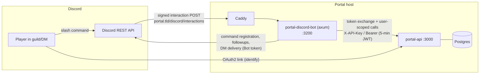

# Discord Integration — Design

**Status:** Proposed (2026-07-25)
**Scope:** portal API (`api/`), web frontend (`web/`), a new `discord_bot/` service, deploy tooling (`deploy/`)
**Companion:** `docs/matchzy-integration.md` — the `/connect` command surfaces that design's `GET /v1/matches/{id}/server` endpoint.

---

## 1. Goals

1. Players **link their Discord account** to their portal account from the profile page — verified via OAuth2, not a typed-in handle.
2. A **Discord bot** lets linked players, from any guild the bot is in (or its DMs):
   - see their upcoming matches and pending to-dos,
   - view/propose/accept/counter **match scheduling** proposals,
   - **find teams** with open spots and **apply to join** them,
   - fetch **game-server connect info** for their live match (privately),
3. The portal **proactively DMs** linked players on relevant events (proposal received, match scheduled, check-in open, server ready — with connect info), with per-user opt-outs.

**Non-goals (this iteration):** Discord *login* (linking only; the `users.auth_provider` CHECK stays `local|steam` for now), guild administration features (channel provisioning, match threads), Linked-Roles verified-player gating (Phase 4+ option), message-content features of any kind, multi-tenant "bot per league" — one portal bot.

---

## 2. Platform facts the design builds on (verified July 2026)

Verified against the live developer docs (now at `docs.discord.com`) — details and citations in the research notes; the load-bearing ones:

- **Interactions arrive via HTTPS webhook, no gateway needed.** Delivery is *either* a gateway websocket *or* an HTTP Interactions Endpoint URL — mutually exclusive. Slash commands, autocomplete, buttons/selects, modals, and ephemeral replies all work endpoint-only; proactive DMs are plain REST with the bot token. A slash-command bot needs **zero privileged intents** and **zero guild permissions** (`bot` + `applications.commands` scopes only). Only cosmetic loss: no gateway session → the bot renders as offline in the member list.
- **Every interaction must be Ed25519-verified** (`X-Signature-Ed25519` over `timestamp ‖ raw body` against the app public key, 401 on failure). Discord actively probes with invalid signatures and disables endpoints that fail to reject them — verification is not optional even in dev.
- **3-second initial response; 15-minute followup window.** The safe pattern is: verify → ack with a deferred response (type 5) → do the real work → edit/followup via the interaction webhook. **Ephemerality is locked at defer time** and can never be toggled afterward — the handler must decide visibility before doing any work. Interaction tokens die at 15 minutes: they are useless for later notifications; anything delayed goes through bot-token DMs.
- **The interaction payload already identifies the user trustworthily.** `member.user.id`/`user.id` arrives inside the signed payload — it cannot be spoofed by the invoker. So per-command auth is: signature-verify → look up snowflake in our link table → act as that portal user. OAuth2 (`identify` scope, authorization-code flow with `state`) is needed **once**, at link time; we can drop Discord's tokens immediately after the `/users/@me` call (data minimization the Discord Developer ToS explicitly wants).
- **Identity = snowflake, never username.** Post-2023, usernames are unique but *mutable*; `global_name` is free-form display. Store `discord_user_id` (a string on the wire; fits BIGINT), refresh display fields opportunistically from interaction payloads.
- **DM sends are fallible by design** — error 50007 (user blocks DMs from the bot/server) and 50278 (no mutual guild) are normal outcomes, and Discord warns against mass-DM patterns. Every notification send must tolerate failure and record undeliverability; delivery generally requires the user to share a guild with the bot.
- **Ephemeral flag (`1 << 6`)** makes a channel reply visible only to the invoker — the right mechanism for connect passwords in a guild channel. Native `<t:unixepoch:F>` timestamp markdown renders in each viewer's local timezone — scheduling displays need no timezone math.
- **Rust stack:** interaction *callbacks* are exempt from the 50 req/s global bot rate limit (DM fan-out is not). Best fit for an axum HTTP-interactions service: **`ed25519-dalek`** for verification + **`twilight-model`** (typed interaction/command/embed types) + **`twilight-http`** (REST: command registration, followups, DMs) — modular, no gateway baggage. serenity/poise only make sense if we later want a gateway.
- Command registration is a REST `PUT` (bulk overwrite) at startup; guild-scoped commands update instantly (use a dev guild for iteration), global commands for production. Subcommand nesting is one level (`/team apply`), 25 options/choices max, autocomplete on string options with ≤25 suggestions.

---

## 3. Architecture overview

A new sibling service — same shape as `steam_bot` and `demo-stats-service`: standalone Rust binary, `.deb` + hardened systemd unit, env-file config, talking to the portal over `/v1/internal/*` with an `X-API-Key` service key.



**The core trick is token exchange.** The bot never re-implements authorization. For each interaction it swaps the verified snowflake for a **short-lived user-scoped JWT** (`POST /v1/internal/discord/token-exchange`), then calls the *normal* public API as that user. Captain rights, registration bindings, roster locks, participant gating on connect info — every existing check applies unchanged, and anything the user couldn't do on the website they can't do via Discord either.

---

## 4. Account linking

### 4.1 Flow

Site-initiated OAuth2 authorization-code, mirroring the Steam OpenID handler's structure (`handlers/steam_auth.rs`) but with two deliberate upgrades: a CSRF `state` parameter (the Steam flow has none — pre-existing gap, flagged in §9) and no token issuance on callback (the user is already logged in; we're linking, not authenticating).

1. Profile page → **Link Discord** → SPA calls `GET /v1/auth/discord/link` (Bearer-authed). The API returns the authorize URL (`https://discord.com/oauth2/authorize?...scope=identify&state=...`) rather than 302ing, since the SPA carries the JWT in a header; the SPA then navigates to it. `state` = HMAC-signed `{user_id, nonce, exp: +10min}` (signed with the existing JWT secret) — the API stays stateless.
2. Discord → `GET /v1/auth/discord/callback?code&state`: verify `state` signature/expiry → exchange `code` at `POST discord.com/api/oauth2/token` (exact `redirect_uri` match) → `GET /users/@me` with the Bearer token → upsert `discord_accounts` → **drop Discord's access/refresh tokens** (nothing stores them; revoke via `/oauth2/token/revoke` best-effort) → 302 to `{frontend_url}/profile/edit?discord=linked` (or `?discord=error&reason=…`).
3. Conflict rule: a snowflake already linked to another portal account → error surfaced on the profile page ("this Discord account is linked to another user — unlink it there first"). Unlink: `DELETE /v1/users/me/discord` (confirm-gated in UI), which also tombstones pending outbox notifications.

New OAuth client code is minimal (reqwest form POST + one GET); no OAuth2 crate needed. Config: `DISCORD_CLIENT_ID`, `DISCORD_CLIENT_SECRET`, callback derived from the existing `PORTAL_PUBLIC_URL`.

### 4.2 Schema (migration `0081_discord_integration.sql`)

```sql
CREATE TABLE discord_accounts (
    user_id UUID PRIMARY KEY REFERENCES users(id) ON DELETE CASCADE,
    discord_user_id BIGINT NOT NULL UNIQUE,      -- snowflake; string on the wire, fits i64
    username VARCHAR(64) NOT NULL,               -- display data only, refreshed opportunistically
    global_name VARCHAR(64),
    avatar_hash VARCHAR(64),
    dm_channel_id BIGINT,                        -- cached Create DM result
    dm_undeliverable_at TIMESTAMPTZ,             -- set on 50007/50278; cleared on next successful interaction
    linked_at TIMESTAMPTZ NOT NULL DEFAULT NOW(),
    last_seen_at TIMESTAMPTZ
);
```

The existing free-text `players.social_links.discord` stays as what it always was — a self-asserted display string. It is **never** used for identity, and the profile UI auto-fills it from the verified link (read-only once linked) to stop the two drifting.

### 4.3 Frontend

`ProfileEditPage.vue` gains a **Connections** card (beside the existing Steam ID field): unlinked → "Link Discord" button; linked → Discord avatar + username + verified chip + unlink (confirm-gated). Handles the `?discord=` callback query param with the standard snackbar. Notification preference toggles (§7.3) live in the same card. Store: `linkDiscord`/`unlinkDiscord`/`updateNotificationPrefs` actions on the players store, standard `createActionState` shape.

---

## 5. The bot service (`discord_bot/`)

Single axum binary, three concerns:

1. **Interactions endpoint** — `POST /interactions`: Ed25519-verify middleware (reject → 401, satisfying Discord's probes) → PONG for PING → dispatch on command/component/autocomplete/modal → **defer immediately** (ephemeral decided here, per command table below) → resolve snowflake via token exchange → call portal API → edit-original/followup with the result. A snowflake with no link (404 from token exchange) gets the standard ephemeral nudge: "Link your Discord on your portal profile: {url}" — every command degrades to this, so `/link` is discoverable but never required knowledge.
2. **Command registrar** — on startup, bulk `PUT` of the command tree (guild-scoped to a dev guild when `DISCORD_DEV_GUILD_ID` is set, global otherwise).
3. **Notification poller** — the `steam_bot` polling pattern: claim pending outbox rows from the portal, deliver via Create DM + Create Message, report sent/failed. Respects `retry_after` on 429s; serializes sends (a small portal's volume never approaches limits, but 50/s global applies to REST, and rapid DM-channel creation is what Discord throttles).

Config (`/etc/portal/discord-bot.env`): `DISCORD_BOT_TOKEN`, `DISCORD_APP_ID`, `DISCORD_PUBLIC_KEY`, `PORTAL_API_URL`, `PORTAL_API_KEY`, `PORTAL_WEB_URL` (for deep links), `BIND_ADDR=127.0.0.1:3200`, `NOTIFY_POLL_SECS=10`.

### 5.1 Command tree → API mapping

All personal data is **ephemeral** in guild channels; deep links to the site accompany everything (Discord is the quick path, the site is the full UI).

| Command | Portal API (as exchanged user) | UX notes |
|---|---|---|
| `/link`, `/unlink` | — / `DELETE /v1/users/me/discord` | `/link` replies ephemerally with the profile-connections URL; `/unlink` confirm-button |
| `/matches [status]` | `GET /v1/users/me/matches?limit=10` | Embed list: opponent, format, `<t:…:F>` scheduled time, status; match picker via autocomplete elsewhere |
| `/todo` | `GET /v1/users/me/action-items` | The pull-based action-items endpoint is a ready-made fit: schedule/respond/check-in/submit/confirm/acknowledge rows with deadlines as `<t:…:R>` |
| `/schedule view <match>` | `GET …/schedule/active` + `GET …/suggestions` | `<match>` is a STRING option with autocomplete fed from `GET /v1/users/me/matches` (id → "vs TeamX (Ro16)"); proposal rendered with **Accept / Counter / Reject** buttons (custom_id carries proposal id + selected-time index for multi-time proposals via a select) |
| `/schedule propose <match>` | `GET …/suggestions` → `POST …/schedule/propose` | Select menu of suggested times (mutual-overlap slots first, labeled with `<t:…:F>`) + an "Other time…" choice opening a modal (ISO/`YYYY-MM-DD HH:MM` text input, parsed in the user's portal timezone `users.timezone`, echoed back as `<t:…>` for confirmation) |
| accept/reject/counter buttons | `POST …/schedule/accept` / `/reject` / `/counter` | Counter reuses the propose select/modal; all three re-render the proposal card via UPDATE_MESSAGE |
| `/team find [game]` | `GET /v1/leagues` → `GET /v1/league-seasons/{id}/teams` | Paginated embed (Prev/Next buttons); open spots derived client-side from `active_member_count` vs `team_size_max` (no server-side filter exists — §9); each page's teams populate an **Apply** select |
| `/team apply <team> [role]` | `POST /v1/league-team-seasons/{id}/apply` | Autocomplete team names; role choice player/substitute; surfaces API errors verbatim (TeamFull, roster lock, duplicate application) |
| `/team invites` | `GET /v1/league-team-invitations/me` | Accept/Decline buttons per row (mind: the endpoint also returns the player's own outbound applications — render those as "pending application" without buttons) |
| `/connect` | `GET /v1/users/me/matches?status=in_progress` (fallback `pick_ban`) → `GET /v1/matches/{id}/server` | **Always ephemeral.** Embed with ` ```connect ip:port; password …``` ` code block (desktop hover-copy), GOTV line, and the `steam://connect/...` URI as plain text (Discord won't hyperlink the scheme). Depends on the MatchZy design §6.2; until then the command reports "no server integration for this match" |
| `/notifications` | `GET/PATCH /v1/players/me` (`notification_settings`) | Select-menu toggles (§7.3) |

Autocomplete handlers also run through token exchange (the 3s window is comfortable against a localhost API; the exchange itself is one indexed lookup + JWT mint).

---

## 6. Portal API additions

### 6.1 Token exchange (the security-critical piece)

```
POST /v1/internal/discord/token-exchange     (AuthenticatedService, permission discord.token_exchange)
body: { "discord_user_id": "190285..." }
200:  { "access_token": "<jwt>", "expires_in": 300, "user_id": "...", "player_id": "...", "username": "..." }
404:  not linked
403:  user status != active
```

Implementation: look up `discord_accounts` → load user (must be `Active`, mirroring `login_with_steam`'s check) → `generate_access_token_with_expiry(user_id, player_id, username, secret, 5)`. Existing `Claims` shape is reused unchanged — it deliberately carries no roles (RBAC is re-read from the DB per request), so a minted token is exactly as powerful as the user's live permissions, never more. Every mint updates `discord_accounts.last_seen_at` and writes an audit row (service key id + snowflake + user). Rate-limited with the `tower_governor` pattern from `routes/auth.rs`. **No refresh tokens are ever minted here** — 5-minute access tokens only, minted per interaction; nothing long-lived exists to steal.

### 6.2 Notification outbox + internal endpoints

No notification infrastructure exists today (confirmed) — this adds the first, kept channel-generic for a future email consumer:

```sql
-- also in 0081_discord_integration.sql
CREATE TABLE notification_outbox (
    id UUID PRIMARY KEY,
    channel VARCHAR(16) NOT NULL DEFAULT 'discord',
    user_id UUID NOT NULL REFERENCES users(id) ON DELETE CASCADE,
    kind VARCHAR(32) NOT NULL,        -- proposal_received | proposal_accepted | proposal_countered
                                      -- | match_scheduled | checkin_open | server_ready
                                      -- | team_application_received | team_application_accepted | team_invite_received
    payload JSONB NOT NULL,           -- ids + display fields the bot needs to render without extra calls
    dedupe_key VARCHAR(128) UNIQUE,   -- e.g. 'server_ready:{reservation_id}:{user_id}'
    status VARCHAR(16) NOT NULL DEFAULT 'pending' CHECK (status IN
        ('pending','claimed','sent','failed','skipped')),
    attempts INTEGER NOT NULL DEFAULT 0,
    last_error TEXT,
    claimed_at TIMESTAMPTZ, sent_at TIMESTAMPTZ,
    created_at TIMESTAMPTZ NOT NULL DEFAULT NOW()
);
CREATE INDEX idx_notification_outbox_pending ON notification_outbox(created_at)
    WHERE status = 'pending' AND channel = 'discord';
```

Internal endpoints mirror the `discovered-matches` claim pattern exactly: `GET /v1/internal/discord/notifications/pending?limit=`, `POST …/{id}/claim`, `…/sent`, `…/failed { error, permanent }` (permanent → `skipped`, and 50007/50278 also stamps `discord_accounts.dm_undeliverable_at`). New service permissions in `portal_core::permissions::service`: `DISCORD_TOKEN_EXCHANGE`, `DISCORD_NOTIFICATIONS_READ`, `DISCORD_NOTIFICATIONS_WRITE` (+ migration seeding `permissions` rows, `category='service'`), minted into a `discord-bot` API key via the existing `portal api-key create` CLI.

**Enqueue points** — a small `NotificationOutboxService` (domain port + Pg adapter, same seam style as `ReviewCreator`): scheduling service (proposal created → opponent's `registered_by` user; accepted/rejected/countered → proposer), lifecycle pass (check-in window opened → both sides), MatchZy event pipeline (`series_start`/reservation `ready` → all lineup players with links: connect info DM), team invitation service (application → captain; accept → applicant; invite → invitee). Enqueue filters on the target user having a non-undeliverable link *and* the preference bit on — cheap skip at write time, re-checked at send time.

### 6.3 Linking endpoints

`GET /v1/auth/discord/link` (Bearer), `GET /v1/auth/discord/callback` (public, rate-limited alongside the auth routes), `DELETE /v1/users/me/discord`, plus `discord` summary on `GET /v1/users/me` (linked bool + username) for the profile UI. The two auth-flow endpoints join the utoipa registration like the Steam pair; the internal ones stay un-annotated per convention.

### 6.4 Notification preferences

`players.notification_settings JSONB` exists today with zero readers — it becomes real:

```json
{ "discord": { "dm_enabled": true, "scheduling": true, "checkin": true, "server_ready": true, "teams": true } }
```

Defaults: all true once linked (linking is itself the opt-in). Surfaced in the profile Connections card and via `/notifications`.

---

## 7. Security considerations

| Concern | Handling |
|---|---|
| Forged interactions | Mandatory Ed25519 verification, 401 on failure (Discord probe-tests this); bot listens on localhost behind Caddy |
| Token exchange abuse | Dedicated service permission; per-mint audit rows; 5-min TTL, no refresh tokens; rate-limited; key in Ansible vault, rotated via existing api-key tooling. Blast radius of a leaked bot key = impersonation of *linked* users' API access until revoked — revocation is one `portal api-key` command, and the audit trail shows exactly which snowflakes were exchanged |
| Privilege escalation via bot | None possible by construction: the bot holds no permissions of its own on user endpoints; it only relays user-scoped tokens whose RBAC is DB-evaluated per request |
| Connect-info leakage | `/connect` and server-ready DMs are ephemeral/DM-only; the API's participant gating (MatchZy §6.2) is the actual authority — the bot can't over-share what the API won't return |
| Link CSRF / account takeover | HMAC `state` (10-min expiry, nonce) on the OAuth flow; snowflake uniqueness constraint; conflict requires explicit unlink on the other account; unlink is confirm-gated and revokes outstanding outbox rows |
| Discord data obligations (ToS) | Store only snowflake + display fields; drop OAuth tokens immediately post-identify (revoke best-effort); unlink = row delete (CASCADE on user deletion); privacy policy note for the app directory |
| Impersonation via free-text handle | `social_links.discord` is display-only, auto-filled from the verified link, never an identity input |
| DM spam / rate limits | Event-driven DMs only, preference-gated, queued with `retry_after` handling; undeliverable accounts marked and skipped |

---

## 8. Deployment

- `discord_bot/` follows the `steam_bot` packaging exactly: `cargo-deb` → `portal-discord-bot.deb` (systemd unit, `User=portal`, env file), GitHub release workflow, `just deploy-discord-bot <deb>`.
- Ansible: new `portal_discord_bot` role (gated `discord_integration_enabled`, default false); vault adds `vault_discord_bot_token`, `vault_discord_client_secret`, `vault_discord_bot_api_key`; `roles/portal_api` renders `DISCORD_CLIENT_ID/SECRET`.
- Caddy: one added route on the main site — `path /discord/interactions` → `127.0.0.1:3200`. No new domain, no new TLS story.
- Developer-portal runbook (documented in `discord_bot/README`): create app → note App ID + Public Key → Bot tab (token; all privileged intents off) → Installation: **Guild Install only**, scopes `bot applications.commands`, permissions `0` → OAuth2: redirect URI `{PORTAL_PUBLIC_URL}/v1/auth/discord/callback` → set Interactions Endpoint URL last (it must already answer the PING).
- Dev loop: `DISCORD_DEV_GUILD_ID` for instant command updates; a fixture-replay test harness for interactions (signed with a throwaway keypair) so handlers are testable without Discord.

---

## 9. Pre-existing gaps this design surfaced (fix independently)

These are portal issues the bot would otherwise inherit and amplify — recommended as prerequisites or fast-follows:

1. **Scheduling authorization is `registered_by`-only** (`SchedulingService::find_user_registration_in_match`): only the account that submitted the registration can propose/accept — not captains, owners, or delegates (the richer `require_registration_actor`/`VetoAuthorizationService` chain used by check-in and lineups). A captain who didn't register their team can't schedule on the site today, and the bot makes that visible. **Recommendation:** switch scheduling authz to `can_act_for_registration` before Phase 2, else `/schedule` will confuse half its users.
2. **`SchedulingService::expire_proposals()` has no caller** — expired proposals linger as `pending`. Wire it into `run_lifecycle_pass` (it's exactly the shape of the existing sweep phases) so `/schedule view` and `/todo` don't show dead proposals.
3. **The "league member before team join" rule is not enforced** — team apply/accept never consults `league_members` (the rule exists only in project docs). Decide: enforce it in `LeagueTeamInvitationService` (then the bot's `/team apply` error message guides the user to `/league join` — endpoints exist) or retire the rule. The bot follows whatever the API decides.
4. **A player cannot withdraw their own team application** (`cancel_invitation` is captain-only). Add requester-cancel; until then the bot's "pending application" rows have no cancel button.
5. **No team search/filter parameters** (`ListLeagueTeamsParams { search }` exists but is unrouted; league list has no `q`). Phase 3 works with client-side filtering over paginated lists at small scale; plumb the search param when leagues grow.

---

## 10. Failure modes

| Failure | Handling |
|---|---|
| Interaction handler exceeds 3s | Deferred ack is sent before any portal call — the deadline applies to the ack, not the work; the 15-min followup window is ample |
| Portal API down mid-interaction | Followup edits the deferred message to a friendly error; deferred-ephemeral means failures never litter channels |
| Snowflake unlinked / link removed between defer and exchange | 404 from token exchange → the standard "link your account" ephemeral response |
| DM undeliverable (50007/50278) | Outbox row → `skipped` (permanent), `dm_undeliverable_at` stamped; next successful interaction from that user clears the flag and re-enables notifications; `/notifications` shows a "DMs unreachable — check your privacy settings / join the community server" warning |
| Bot offline for a stretch | Outbox rows accumulate as `pending`; on restart the poller drains oldest-first; `dedupe_key` keeps re-enqueues idempotent; time-sensitive kinds (`server_ready`, `checkin_open`) are dropped by the poller when older than their relevance window (payload carries `expires_at`) |
| Duplicate event enqueue (e.g. MatchZy webhook retry path) | `dedupe_key` UNIQUE constraint — second insert no-ops |
| Discord 429s | `twilight-http` surfaces `retry_after`; poller backs off; interaction callbacks are exempt from the global limit |
| Command drift (registered tree ≠ handler set) | Registrar derives the `PUT` payload from the same command definitions the dispatcher matches on — one source of truth in code |

---

## 11. Rollout phases

| Phase | Deliverable | Proves |
|---|---|---|
| **1 — Linking + read-only bot** | Migration 0081, OAuth link/unlink + profile Connections card, bot skeleton (Ed25519, defer/followup, registrar), token exchange, `/link` `/matches` `/todo` | Identity chain end-to-end: snowflake → portal user → authorized API read |
| **2 — Scheduling** | Prereqs §9.1–2, `/schedule view|propose` + accept/counter/reject components, outbox + poller + scheduling/check-in notification kinds, `/notifications` | Two-way workflows with components/modals; first proactive DMs |
| **3 — Teams** | `/team find|apply|invites` (+ §9.3–4 decisions), team notification kinds | Discovery + application loop from Discord |
| **4 — Server integration + polish** | `/connect`, `server_ready` connect-info DMs (needs MatchZy Phase 2+), optional: Linked-Roles verified-player metadata, league announcement channels, user-install contexts | The full "veto on site → get pinged with connect string in Discord" experience |

Everything gates on `discord_integration_enabled` (deploy) and per-user linking (product) — unlinked users see zero change.

---

## 12. Open questions

1. **Guild strategy:** one official community guild the bot lives in (simplest DM-eligibility story — joining it guarantees a mutual guild), or install-anywhere from day one? (Design assumes install-anywhere works, but the official guild is the recommended path for reliable DMs.)
2. **`/schedule propose` time entry:** is the suggested-times select + free-text modal enough, or do we want a calendar-style component (Components V2 date handling is still just text) — worth a UX pass after Phase 2 telemetry?
3. **Public vs ephemeral for `/team find`:** ephemeral keeps channels clean, but a public browse card could be deliberate community advertising — per-guild setting or always ephemeral?
4. **Discord login** (auth_provider `discord`): the linking table makes it a small step later — is it wanted? (Would require the §4.1 conflict rules to become account-merge rules.)
5. **Result notifications:** should `series_end`/result-confirmed events DM players too (kind `result_posted`)? Cheap to add once the outbox exists — left out of the initial kind list to keep DM volume respectful.
