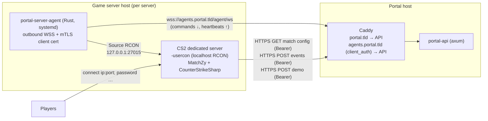

# MatchZy Game-Server Integration — Design

**Status:** Phases 1–3 implemented (2026-07-25) on branches `matchzy-phase1` (this repo + `api/`) and `server-agent/` (new sibling repo); Phase 4 proposed
**Scope:** portal API (`api/`), web frontend (`web/`), a new `server-agent/` component, deploy tooling (`deploy/`)
**Supersedes:** `api/docs/gaming-portal-hld.md` §6.8 (get5/RCON-inbound adapter design) and refines `api/docs/gaming-portal-database-schema.md` §11 for MatchZy.

---

## 1. Goals

After a match's map veto completes, the portal automatically:

1. reserves a registered CS2 server running [MatchZy](https://github.com/shobhit-pathak/MatchZy),
2. generates a MatchZy match config from the veto result and rosters (maps, sides, SteamID64 lineups, passwords),
3. instructs the server to load it,
4. shows players a connect panel (`connect ip:port; password …`, `steam://` link, GOTV info),
5. ingests MatchZy's live webhooks (going-live, round scores, map results, series result) to drive the match state machine and a live scoreboard,
6. receives the GOTV demo upload and feeds it into the existing demo → stats → validation pipeline,
7. auto-submits the series result into the existing result-claim / review / completion-saga flow.

Admins get a **Game Servers** registry page (add/edit servers, one-time enrollment, health, current match, maintenance, revoke).

**Non-goals (this iteration):** cloud provider auto-provisioning (DatHost/EC2), multi-game abstraction beyond keeping game-specific code in the CS2 plugin, in-server veto (the portal veto is authoritative), coach slots (MatchZy config cannot express them; players use `.coach` in-game), pausing/backup admin tooling (Phase 4+).

---

## 2. MatchZy integration surface (verified, v0.8.15)

Everything below was verified against MatchZy source at the latest release (0.8.15, 2025-10-25). This section is the contract the rest of the design builds on; quirks that differ from MatchZy's own docs are called out because we must code against the source behavior.

### 2.1 What the portal can drive

- **Match load:** `matchzy_loadmatch_url "<url>" "<header name>" "<header value>"` — server-console/RCON-only command; synchronous HTTPS GET; **exactly one optional header pair** (both name and value or neither). Refuses to load if a match is already set up (`css_endmatch` first). There is no load-success callback other than the `series_start` webhook firing immediately on successful load.
- **Match config JSON** (required: `maplist`, `team1`, `team2`, `num_maps`):
  - `matchid` — **integer**, not a UUID. Echoed in every webhook event.
  - `team1`/`team2` — `{ "name": …, "id": …, "players": { "<steamid64>": "<name>", … } }`.
  - `map_sides` — array of `"team1_ct" | "team1_t" | "team2_ct" | "team2_t" | "knife"`, one per map. **Missing/short entries default to `"knife"`** — to fully honor portal-side veto sides we must emit a complete non-knife array (or `"knife"` deliberately for knife-mode formats).
  - `skip_veto` — defaults to `true`, and is force-set to `true` when `maplist.length == num_maps`. We always emit `maplist` of exactly `num_maps` picked maps in play order.
  - `cvars` — object of cvar/command → value executed at load time and **restored at series end** (`matchzy_reset_cvars_on_series_end`, default true). This is our vehicle for `sv_password` (MatchZy itself never touches `sv_password`), `hostname`, `tv_delay`, and the **per-match webhook URL + auth header cvars**.
  - `players_per_team` (default 5), `clinch_series` (default true), `spectators.players`, `wingman`.
- **Roster lockdown is automatic:** once a config is loaded, connecting SteamIDs not listed in `team1`/`team2`/`spectators` are kicked. `matchzy_kick_when_no_match_loaded` (default false) additionally makes the server match-only between loads — we enable it on managed servers.
- **Lifecycle commands (all RCON-able):** `css_endmatch` (cancel/reset), `css_start` (force start), `css_pause`/`css_unpause`, `matchzy_loadbackup_url` (round restore, same one-header rule), `matchzy_addplayer`/`matchzy_removeplayer` (live roster edits).
- **Status poll:** `get5_status` returns JSON: `gamestate` (`none|warmup|knife|going_live|live|pending_restore|post_game|…`), `matchid`, `map_number`, `round_number`, per-team `{name, series_score, current_map_score, ready, side}`. (Known gaps: `connected_clients` is always -1.)

### 2.2 What MatchZy pushes to the portal

- **Event webhooks:** `matchzy_remote_log_url` + `matchzy_remote_log_header_key/_value` (one header pair, appliable per-match via the `cvars` block). POST JSON, 15s timeout, **no retries, no dedup** — the portal must be fast, idempotent, and able to reconcile missed events (§6.6).
  - Events emitted: `series_start` (on successful config load — our "load ack"), `going_live`, `round_end` (full per-player stats), `map_result`, `series_end`. (`map_vetoed`/`map_picked`/`side_picked` exist but only fire for in-server veto, which we skip.)
  - **Payload quirks (code against these):**
    - `winner.side` is the CS team number as a string (`"3"` = CT, `"2"` = T), not `"ct"/"t"` as the schema claims.
    - `round_end.winner.team` is the team currently **leading the map**, not the round winner — derive round outcomes from score deltas; derive series winner from `team1_series_score`/`team2_series_score`, never from `winner.team` strings.
    - `map_result` has empty `players` arrays; per-player stats only arrive on `round_end` (and in MatchZy's local SQLite/CSV, a recovery source).
    - `demo_upload_ended` and `player_disconnect` are defined in source but **never emitted** — do not wait on them.
- **Demo upload:** `matchzy_demo_upload_url` + `matchzy_demo_upload_header_key/_value`. POST of **raw `.dem` bytes** (`application/octet-stream` — the docs say "zipped", the source does not zip) with headers `MatchZy-FileName`, `MatchZy-MatchId`, `MatchZy-MapNumber` (0-indexed), `MatchZy-RoundNumber`. Fires per map, ~15s+ after GOTV flush. No retries.
- **Round backups:** `matchzy_remote_backup_url` (+ header pair) POSTs a JSON backup after every round — Phase 4 disaster-recovery input; same upload endpoint pattern.

### 2.3 The control-channel reality

MatchZy/CounterStrikeSharp expose **no inbound HTTP/WS API**. The only way in is the server console — i.e. Source RCON (CS2 supports it with `-usercon`; the in-game client `rcon` command is broken in CS2 but server-to-server RCON libraries work). Everything outbound (config fetch, events, demos) is plain HTTPS with at most one custom header.

So the integration shape is: **RCON in, webhooks out** — and the design's job is to make "RCON in" safe over the internet.

---

## 3. Architecture overview

Raw Source RCON from the portal to game servers over WAN is a non-starter: the protocol is plaintext password auth, it shares the game port, and it would require every server to firewall-allow the portal and us to store live RCON passwords centrally. Instead, each game server host runs a small **portal server agent** that dials **out** to the portal over WSS with an **mTLS client certificate**, and executes commands against RCON on `127.0.0.1` only.



Why an agent daemon instead of (a) direct RCON or (b) a custom CounterStrikeSharp plugin:

| | Direct RCON | CS# plugin w/ outbound WS | **Rust sidecar agent (chosen)** |
|---|---|---|---|
| Security | Plaintext password over WAN, no mTLS possible | mTLS possible | mTLS, RCON never leaves localhost |
| NAT/firewall | Portal must reach every server | Outbound-only | Outbound-only |
| Toolchain | — | C#/.NET, CSSharp API churn, hard to test headless | Rust like everything else; unit-testable; ships as `.deb` + systemd via the existing Ansible model |
| Survives game crash | n/a | Dies with the game process | Keeps running, reports server down, can restart the game unit (future) |

The CS# plugin route stays open as a future optimization (in-process event hooks), but the agent is the right first implementation for this codebase.

**Trigger direction:** the portal never contacts the game server host inbound. It pushes commands down the agent's already-open WSS connection; MatchZy pulls its config from a portal URL and pushes events/demos to portal URLs.

### 3.1 Happy-path sequence

```mermaid
sequenceDiagram
    participant V as Veto (portal)
    participant S as MatchServerService
    participant A as Agent (WSS)
    participant M as MatchZy server
    participant P as Players

    V->>S: veto session completed
    S->>S: allocate server (FOR UPDATE SKIP LOCKED), create reservation,<br/>mint config + event + demo tokens, build MatchZy config
    S->>A: cmd: load_match { url, header }
    A->>M: RCON: matchzy_loadmatch_url "…" "Authorization" "Bearer …"
    M->>S: GET /gameserver/match-config/{matchzy_id} (Bearer)
    M->>S: POST event series_start   → reservation: ready
    S-->>P: WS: server_assignment_update (connect info panel)
    P->>M: connect ip:port; password …
    M->>S: POST event going_live     → match: pick_ban → in_progress
    loop each round
        M->>S: POST event round_end  → live scoreboard broadcast
    end
    M->>S: POST event map_result     → tournament_match_games row finalized
    M->>S: POST event series_end     → server-sourced ResultClaim → completion saga
    M->>S: POST demo (.dem bytes)    → S3 portal-demos → scanner/demo-stats pipeline
    S->>S: release reservation, server → available
```

---

## 4. Data model (migration `0080_game_servers.sql`)

Aligned with the never-implemented `api/docs/gaming-portal-database-schema.md` §11 vocabulary (`game_servers`, `server_reservations`, `server_events`), adapted to the real schema (`tournament_matches`, TEXT check constraints, UUID v7 ids) and to MatchZy (no per-server RCON secrets in the portal DB at all — that's the agent's local concern).

```sql
CREATE TABLE game_servers (
    id UUID PRIMARY KEY,                          -- GameServerId (newtype already exists, unused)
    name VARCHAR(128) NOT NULL,
    game_id VARCHAR(32) NOT NULL REFERENCES games(id),

    -- Connection info shown to players / used in connect strings
    ip_address INET NOT NULL,
    port INTEGER NOT NULL CHECK (port > 0 AND port < 65536),
    gotv_port INTEGER,
    region VARCHAR(32) NOT NULL,

    -- Ops
    enabled BOOLEAN NOT NULL DEFAULT TRUE,        -- admin kill-switch (maintenance)
    status VARCHAR(20) NOT NULL DEFAULT 'offline' CHECK (status IN
        ('offline','available','reserved','configuring','in_match',
         'busy_external',   -- heartbeat shows a match/pug the portal didn't set up (§6.7)
         'error')),
    current_match_id UUID REFERENCES tournament_matches(id),

    -- Agent identity & health
    agent_cert_serial VARCHAR(64),                -- serial of the currently-valid client cert
    agent_cert_expires_at TIMESTAMPTZ,
    agent_version VARCHAR(32),
    last_heartbeat_at TIMESTAMPTZ,
    last_gamestate VARCHAR(32),                   -- from get5_status

    -- Enrollment (one-time, hashed like api_keys)
    enrollment_token_hash VARCHAR(64),
    enrollment_token_expires_at TIMESTAMPTZ,

    created_at TIMESTAMPTZ NOT NULL DEFAULT NOW(),
    updated_at TIMESTAMPTZ NOT NULL DEFAULT NOW()
);
CREATE INDEX idx_game_servers_available ON game_servers(game_id, region, status)
    WHERE status = 'available' AND enabled;

CREATE TABLE server_reservations (
    id UUID PRIMARY KEY,
    server_id UUID NOT NULL REFERENCES game_servers(id),
    match_id UUID NOT NULL REFERENCES tournament_matches(id),

    -- MatchZy needs an integer matchid; also our webhook correlation key
    matchzy_id BIGINT GENERATED ALWAYS AS IDENTITY UNIQUE,

    status VARCHAR(20) NOT NULL DEFAULT 'pending' CHECK (status IN
        ('pending',        -- created, awaiting allocation/agent
         'configuring',    -- load_match sent, awaiting series_start
         'ready',          -- series_start received, players may connect
         'live',           -- going_live received
         'completed',      -- series_end received
         'failed',
         'cancelled')),

    -- Secrets (generated per reservation)
    connect_password VARCHAR(64) NOT NULL,        -- sv_password; shown to participants+admins only
    gotv_password VARCHAR(64),
    config_token_hash VARCHAR(64) NOT NULL,       -- Bearer for the config GET
    event_token_hash VARCHAR(64) NOT NULL,        -- Bearer for event POSTs
    config_token_expires_at TIMESTAMPTZ NOT NULL,

    -- The exact config served to MatchZy (audit + replay)
    match_config JSONB,

    config_fetched_at TIMESTAMPTZ,
    went_live_at TIMESTAMPTZ,
    completed_at TIMESTAMPTZ,
    failure_reason TEXT,
    retry_count INTEGER NOT NULL DEFAULT 0,

    created_at TIMESTAMPTZ NOT NULL DEFAULT NOW(),
    updated_at TIMESTAMPTZ NOT NULL DEFAULT NOW()
);
-- one live reservation per match / per server (mirrors the saga dedupe backstop pattern)
CREATE UNIQUE INDEX uq_server_reservations_live_match ON server_reservations(match_id)
    WHERE status IN ('pending','configuring','ready','live');
CREATE UNIQUE INDEX uq_server_reservations_live_server ON server_reservations(server_id)
    WHERE status IN ('pending','configuring','ready','live');

-- Scheduled event holds: block a server (or a window on it) for a specific
-- tournament/event so auto-allocation for other tournaments — or any future
-- pug/scrim consumer — cannot take it (§6.7).
CREATE TABLE server_bookings (
    id UUID PRIMARY KEY,
    server_id UUID NOT NULL REFERENCES game_servers(id) ON DELETE CASCADE,
    tournament_id UUID REFERENCES tournaments(id) ON DELETE CASCADE,  -- NULL = hard hold (maintenance, community night)
    reason VARCHAR(255),
    starts_at TIMESTAMPTZ NOT NULL,
    ends_at TIMESTAMPTZ NOT NULL,
    created_by UUID NOT NULL REFERENCES users(id),
    created_at TIMESTAMPTZ NOT NULL DEFAULT NOW(),
    CHECK (ends_at > starts_at)
);
CREATE INDEX idx_server_bookings_window ON server_bookings(server_id, starts_at, ends_at);

CREATE TABLE server_events (
    id UUID PRIMARY KEY,
    reservation_id UUID REFERENCES server_reservations(id) ON DELETE SET NULL,
    server_id UUID REFERENCES game_servers(id) ON DELETE SET NULL,
    event_type VARCHAR(64) NOT NULL,              -- matchzy event name; no CHECK enum — matchzy owns this vocabulary
    map_number INTEGER,
    round_number INTEGER,
    payload JSONB NOT NULL,
    processed BOOLEAN NOT NULL DEFAULT FALSE,
    processed_at TIMESTAMPTZ,
    processing_error TEXT,
    received_at TIMESTAMPTZ NOT NULL DEFAULT NOW()
);
CREATE INDEX idx_server_events_unprocessed ON server_events(received_at) WHERE NOT processed;
-- idempotency: one row per logical event
CREATE UNIQUE INDEX uq_server_events_dedupe ON server_events(
    reservation_id, event_type, COALESCE(map_number,-1), COALESCE(round_number,-1));

-- server-sourced result claims (see §6.5)
ALTER TABLE result_claims
    ADD COLUMN source VARCHAR(16) NOT NULL DEFAULT 'participant'
        CHECK (source IN ('participant','server','admin')),
    ALTER COLUMN submitted_by_registration_id DROP NOT NULL;  -- exact column name per current schema
```

Notes:

- **`0075`-style numbering:** next free migration number is `0080`.
- **`tournament_match_games` finally gets populated.** The dormant `PgTournamentMatchGameRepository` gets wired into `AppState`; rows are created at config generation (map, `game_number`, `map_picked_by`, side info from veto), moved to `in_progress` on `going_live`/map advance, finalized on `map_result`.
- **New ID newtypes** in `portal-core/src/ids.rs`: `ServerReservationId`, `ServerEventId` (`GameServerId` already exists at line 417, unused).
- **No `server_configurations` table yet** — per-tournament cvar overrides can live in `tournaments.settings` JSONB (§6.2); promote to a table if templates grow.
- All tokens stored as SHA-256 hashes (same pattern as `api_keys.key_hash`); raw values exist only in the generated cvars/URLs.

### 4.1 Certificate registry

```sql
CREATE TABLE server_agent_certs (
    id UUID PRIMARY KEY,
    server_id UUID NOT NULL REFERENCES game_servers(id) ON DELETE CASCADE,
    serial VARCHAR(64) NOT NULL UNIQUE,
    fingerprint_sha256 VARCHAR(64) NOT NULL,
    not_before TIMESTAMPTZ NOT NULL,
    not_after TIMESTAMPTZ NOT NULL,
    revoked_at TIMESTAMPTZ,
    issued_at TIMESTAMPTZ NOT NULL DEFAULT NOW()
);
CREATE INDEX idx_server_agent_certs_server ON server_agent_certs(server_id) WHERE revoked_at IS NULL;
```

Caddy validates chain + validity window against the portal CA; the API additionally checks the presented serial against this table (revocation + server binding), so revocation takes effect immediately without CRL distribution.

---

## 5. Control channel: agent, mTLS, protocol

### 5.1 `portal-server-agent` (new top-level Rust project, sibling of `steam_bot`)

Single small binary, mirroring the `steam_bot` conventions (clap + env config, `.deb` via `cargo-deb`, hardened systemd unit, `EnvironmentFile=/etc/portal/server-agent.env`):

```
PORTAL_AGENT_URL=wss://agents.portal.example.com/agent/ws
PORTAL_AGENT_CERT=/etc/portal/agent/client.pem      # obtained via enrollment
PORTAL_AGENT_KEY=/etc/portal/agent/client.key
PORTAL_AGENT_CA=/etc/portal/agent/portal-ca.pem     # pins the portal's CA
RCON_ADDR=127.0.0.1:27015
RCON_PASSWORD=...                                    # local secret; never leaves the host
```

Behavior:

- Connects outbound WSS with the client cert; reconnects with jittered backoff; buffers nothing (commands are portal-side retried).
- Executes portal commands via Source RCON to localhost (`rcon` crate); the CS2 server runs with `-usercon` and a strong `rcon_password`, and the host firewall (ufw, part of the install docs) blocks the game port for RCON from anywhere but localhost is inherently satisfied since RCON rides the game port — the strong password plus never using it remotely is the mitigation.
- Heartbeats every 30s: `{agent_version, rcon_ok, get5_status: {...}}` (runs `get5_status`, forwards the JSON). Portal marks servers `offline` after 90s of silence.
- First-run enrollment mode (§5.3).

### 5.2 Command protocol (JSON frames over WSS)

```jsonc
// portal → agent
{ "id": "01J…", "cmd": "load_match",
  "args": { "url": "https://portal…/match-config/123", "header_name": "Authorization", "header_value": "Bearer …" } }
{ "id": "01J…", "cmd": "end_match" }        // css_endmatch
{ "id": "01J…", "cmd": "roster_edit",       // mid-series substitution (§6.8)
  "args": { "remove": ["7656119…"], "add": [{ "steamid64": "7656119…", "team": "team1", "name": "…" }] } }
{ "id": "01J…", "cmd": "exec", "args": { "command": "css_pause" } }   // admin passthrough, audited
{ "id": "01J…", "cmd": "status" }           // get5_status on demand

// agent → portal
{ "id": "01J…", "ok": true, "output": "…rcon response…" }
{ "id": "01J…", "ok": false, "error": "rcon timeout" }
{ "type": "heartbeat", "agent_version": "0.1.0", "rcon_ok": true, "get5_status": { … } }
```

`load_match` is a dedicated command (rather than generic `exec`) so the agent can quote-wrap arguments safely and the portal-side audit log is structured. Every `exec` is written to the existing audit-log path with the acting admin.

Portal side: `AgentConnectionManager` (`portal-api/src/websocket/agent_manager.rs`) — `DashMap<GameServerId, AgentConnection>` mirroring `VetoLobbyManager`; services send commands through it with a per-command timeout (10s) and get typed results. A command to a disconnected agent fails fast; reservation retry logic (§6.6) owns recovery. Like the veto lobby, this is process-local — fine for the current single-instance deployment.

### 5.3 CA and enrollment

- **Portal-private CA**, generated once: `portal-cli gameserver ca-init` (writes CA key/cert to `/etc/portal/agent-ca/`, key `0600 portal:portal`; `rcgen` crate). The CA cert (not key) is given to Caddy and to agents.
- **Enrollment flow:**
  1. Admin creates the server in the UI → portal generates a one-time enrollment token (`cgs_` + 48 chars, hashed in DB, 24h TTL), shown once with a copyable install snippet.
  2. On the game host: `portal-server-agent enroll --token cgs_… --url https://portal…` → agent generates a keypair locally, sends a CSR + token to `POST /v1/gameserver/enroll` (plain HTTPS — no client cert yet).
  3. Portal validates the token, signs the CSR (CN = server UUID, 90-day validity), records serial/fingerprint in `server_agent_certs`, invalidates the token, returns the cert chain.
  4. Agent stores cert/key, connects WSS. **Renewal:** agent re-submits a CSR over the established mTLS channel when <30 days remain; portal signs and records, old cert rows expire naturally.
- **Revoke** (admin action): mark cert revoked → API drops the live agent connection; re-enrollment requires a fresh token.

### 5.4 TLS termination (prod: Caddy; matches the existing single-Linode model)

New site in `roles/caddy/templates/Caddyfile.j2`:

```caddyfile
agents.{{ portal_domain }} {
    tls {
        client_auth {
            mode require_and_verify
            trusted_ca_cert_file /etc/portal/agent-ca/ca.pem
        }
    }
    reverse_proxy 127.0.0.1:3000 {
        header_up X-Client-Cert-Serial {tls_client_serial}
        header_up X-Client-Cert-Fingerprint {tls_client_fingerprint}
    }
}
```

The API trusts these headers **only** on the agent routes and only because the API listens on localhost behind Caddy; the handler strips/rejects them if the request arrives on any other route. It then resolves serial → `server_agent_certs` → server id (revocation + binding check). Dev/e2e mode: `PORTAL_AGENT_INSECURE=true` accepts a `X-Dev-Server-Id` header instead, gated behind the existing `test-utils`-style config, so integration tests can drive a fake agent over plain WS.

(Alternative considered: a second rustls listener with client-cert verification inside `portal-app`. Rejected for now — it duplicates TLS ops that Caddy already owns, and cert rotation/ACME are already solved there. Revisit if the portal ever runs multi-instance behind a real LB.)

MatchZy's own HTTPS calls (config GET, events POST, demo POST) go to the **normal** `{{ portal_domain }}` site with per-reservation Bearer tokens — MatchZy can't present client certs, and its single-header limit is exactly one `Authorization` header.

---

## 6. Backend design (`api/`)

### 6.1 New modules, following the three-layer pattern

| Layer | New code |
|---|---|
| `portal-core` | `ServerReservationId`, `ServerEventId` ids; `types/game_server.rs`: `GameServerStatus`, `ReservationStatus`, `AgentCommand`, `AgentGamestate` enums; permission constants `admin::SERVERS_MANAGE`, `service::gameserver` group |
| `portal-domain` | `entities/game_server.rs` (`GameServer`, `ServerReservation`, `ServerEvent`, `AgentCertificate`); `repositories/game_server.rs` traits; `services/game_server/{registry.rs, allocation.rs, match_setup.rs, events.rs}` |
| `portal-db` | row structs + `PgGameServerRepository`, `PgServerReservationRepository`, `PgServerEventRepository`, `PgAgentCertRepository`; wire `PgTournamentMatchGameRepository` into `AppState` |
| `portal-plugins` | `games/cs2/matchzy.rs`: `MatchzyConfigBuilder` (veto result + lineups → MatchZy JSON), `MatchzyEvent` deserializers (tolerant of §2.2 quirks), demo filename conventions. Exposed to domain via a `ServerMatchConfigProvider` trait + `PluginServerConfigProvider` adapter in `portal-api/src/adapters/` — same shape as the existing `VetoFormatProvider`/`PluginVetoFormatProvider` pair |
| `portal-api` | `handlers/game_servers/{admin.rs, agent_ws.rs, matchzy.rs, player.rs}`, `routes/game_servers.rs`, DTOs, OpenAPI registration, `websocket/agent_manager.rs`, background integration |
| `portal-cli` | `commands/gameserver.rs`: `ca-init`, `list`, `enroll-token`, `revoke` |

### 6.2 Route surface

**Admin (JWT + `admin.servers.manage`, tag `game_servers`):**

| Route | Purpose |
|---|---|
| `GET/POST /v1/admin/game-servers` | list (status, heartbeat age, cert expiry, current match) / register |
| `GET/PATCH/DELETE /v1/admin/game-servers/{id}` | detail / edit / remove (confirm-gated; refuses while a live reservation exists) |
| `POST /v1/admin/game-servers/{id}/enrollment-token` | mint + return one-time token (returns raw once) |
| `POST /v1/admin/game-servers/{id}/revoke` | revoke cert, drop connection |
| `POST /v1/admin/game-servers/{id}/command` | audited console passthrough (`exec`) |
| `POST /v1/matches/{id}/server/assign` | manual assignment (body: optional `server_id`) |
| `DELETE /v1/matches/{id}/server` | cancel reservation (sends `end_match`, releases) |

**Server-facing (excluded from public OpenAPI, like `handlers/internal.rs`):**

| Route | Auth | Purpose |
|---|---|---|
| `POST /v1/gameserver/enroll` | one-time token | CSR → signed cert |
| `GET /v1/gameserver/agent/ws` | mTLS (Caddy headers) | agent WSS upgrade |
| `GET /v1/gameserver/match-config/{matchzy_id}` | per-reservation config Bearer | serves `match_config` JSONB; marks `config_fetched_at`; token valid for 15 min / up to 5 fetches (MatchZy may retry) |
| `POST /v1/gameserver/events` | per-reservation event Bearer | webhook ingest (§6.4) |
| `POST /v1/gameserver/demos` | per-reservation event Bearer | demo ingest (§6.5); **route-level body limit 1 GiB, streaming to S3** |

**Player-facing (tag `match_lifecycle`):**

| Route | Purpose |
|---|---|
| `GET /v1/matches/{id}/server` | reservation status + connect info. Participants (via the existing `require_registration_actor`/lineup check) get `connect_string` + password + `steam_connect_url`; everyone else gets GOTV info only (respecting `tv_delay`). 404 when no reservation. |

Rate limiting: the three MatchZy-facing endpoints and `enroll` get a `tower_governor` layer (pattern already exists in `routes/auth.rs`).

### 6.3 Match config generation (`MatchzyConfigBuilder`)

Inputs: `TournamentMatch` (+ `match_format` → `num_maps`), completed `VetoSessionState`, both registrations' lineups (declared lineup if present, else roster) with `players.steam_id_64`, reservation secrets, tournament `settings.game_server` overrides.

```jsonc
{
  "matchid": 123,                      // server_reservations.matchzy_id
  "num_maps": 3,
  "maplist": ["de_mirage", "de_nuke", "de_ancient"],   // veto_sessions.selected_maps, play order
  "map_sides": ["team2_ct", "team1_ct", "knife"],      // derived below
  "skip_veto": true,
  "clinch_series": true,
  "players_per_team": 5,
  "min_players_to_ready": 5,
  "team1": { "id": "<registration1 uuid>", "name": "…", "players": { "7656119…": "name", … } },
  "team2": { "id": "<registration2 uuid>", "name": "…", "players": { … } },
  "cvars": {
    "hostname": "Portal | {TEAM1} vs {TEAM2}",
    "sv_password": "<connect_password>",
    "tv_enable": "1", "tv_delay": "105", "tv_password": "<gotv_password>",
    "matchzy_remote_log_url": "https://portal…/v1/gameserver/events",
    "matchzy_remote_log_header_key": "Authorization",
    "matchzy_remote_log_header_value": "Bearer <event_token>",
    "matchzy_kick_when_no_match_loaded": "1"
  }
}
```

- **`map_sides` derivation:** for each picked map in `game_number` order, look up the `veto_actions.side_selection` (`"ct"/"t"`) chosen for it and by which registration; translate to `team1_ct`/`team2_ct`/… relative to which registration is `team1` (always `participant1_registration_id`). No side action recorded (decider, or `SideSelectionMode::Knife`) → `"knife"`. The array is always emitted full-length — MatchZy defaults missing entries to knife, which would silently override portal veto sides.
- **Missing Steam IDs are a hard precondition:** assignment fails with a user-visible reason listing players without `steam_id_64` (surfaced in the match panel; captains fix profiles and an admin/auto retry re-runs). This is checked at veto completion, not first at load time.
- **Demo upload cvars are NOT set per-match** (a cvar restore at series end can race the final map's demo upload — §2.2 timing). Instead the agent writes them once into `cfg/MatchZy/config.cfg` at install/rotation with a **server-scoped** demo token; `MatchZy-MatchId` correlates uploads to reservations.

### 6.4 Event ingest pipeline

`POST /v1/gameserver/events` handler: authenticate token → resolve reservation → insert `server_events` row (dedupe index makes replays no-ops) → return 200 **immediately** (15s MatchZy timeout, no retries) → process synchronously after insert in the same request where cheap, else the background pass sweeps unprocessed rows. Processing per type:

| Event | Effect |
|---|---|
| `series_start` | reservation `configuring → ready`; server `configuring → in_match`; WS broadcast connect info |
| `going_live` | reservation `ready → live` (first map); match `pick_ban → in_progress` via `MatchLifecycleService::transition` with `TransitionTrigger::System { job_name: "gameserver" }`; `tournament_match_games[map_number]` → in_progress |
| `round_end` | update live score snapshot on the reservation (or in-memory); WS `live_score_update` broadcast (per-map score, round number); per-player stats retained on the event row for Phase-4 stats use |
| `map_result` | finalize `tournament_match_games[map_number]` (scores, winner by comparing `team1.score`/`team2.score` — not `winner.team`); WS update |
| `series_end` | winner from `team1_series_score` vs `team2_series_score`; create server-sourced result claim (§6.5); reservation → completed; release server (§6.6) |

All WS broadcasts ride the **existing per-match veto lobby channel** (§7.3).

### 6.5 Results and demos into the existing flows

**Result claim:** new `ResultService::submit_server_claim(match_id, reservation_id, winner, scores, game_results)` — parallel to `submit_claim` but with `source='server'`, no submitting registration, and per-map `GameResultInput` from the `map_result` events. Confirmation policy: the claim enters the normal confirm window as if the *losing* side needed to act — both captains get the standard confirm/dispute UI; the existing `process_overdue_result_claims` auto-confirm sweep completes it if nobody acts (tournament setting `settings.game_server.auto_confirm_minutes`, default 10). Disputes flow into the existing dispute + result-review machinery unchanged; `MatchCompletionSaga` runs as today (demo validation, review-on-mismatch, standings, progression).

**Demo:** `POST /v1/gameserver/demos` streams the body to S3 `portal-demos` (`portal-storage` S3 multipart; key `matchzy/{matchzy_id}/{MatchZy-FileName}`) → creates/updates the `demos` catalog row directly (we don't need to wait for `portal-scanner` to discover it, though its `(s3_bucket,s3_key)` uniqueness makes double-cataloging harmless) → creates `demo_match_links` with `link_type='auto_matched'`, `game_number = MatchZy-MapNumber + 1`, validated=false → existing demo-stats fetch + validation flow takes over. **Deploy note:** this route needs a Caddy path override (long `read_timeout`, no buffering) — CS2 demos run 100–300 MB, well past the current 60s/16 MiB defaults.

### 6.6 Assignment lifecycle, retries, reconciliation

Trigger points for `MatchServerService::request_assignment(match_id)`:

1. **Veto completion** — called from `VetoService`'s two completion call sites (REST + WS handler; the small duplication already exists for the `VetoComplete` broadcast and is noted as a refactor opportunity: extract a shared `on_veto_complete` in `portal-api`).
2. **Matches without veto** — on transition to `in_progress`-eligible states (check-in complete), when the tournament has server integration enabled.
3. **Manual** — admin endpoint.

Gating: `tournaments.settings.game_server = { "enabled": true, "region": "eu-west", "auto_confirm_minutes": 10, "cvars": {…} }` (settings JSONB already exists on tournaments).

Assignment is **state-driven, not fire-and-forget** — the existing lifecycle background pass (`run_lifecycle_pass`) gains a phase:

- `pending` reservations: allocate (`SELECT … FOR UPDATE SKIP LOCKED` over servers passing the §6.7 predicate), build config, send `load_match`, → `configuring`. No server available → stays pending, surfaced in UI ("waiting for a free server, position N").
- `configuring` older than 2 min without `series_start`: retry `load_match` (idempotent: agent runs `css_endmatch` first) up to `max_retries=3`, then → `failed`, server → `error`, admins see it on the dashboard, participants see "server setup failed — an admin has been notified".
- `ready` with no `going_live` after `settings.game_server.no_show_minutes` (default 20): flag for admin (ties into existing no-show/forfeit tooling rather than auto-forfeiting).
- **Reconciliation (webhooks are lossy):** for `live`/`ready` reservations whose last event is stale (>5 min), ask the agent for `get5_status`; `gamestate: post_game|none` with a missing `series_end` → recover the result from get5_status series scores, or mark for admin review. This is the safety net for MatchZy's no-retry webhooks.
- Release: on completed/failed/cancelled → server back to `available` once a heartbeat shows `gamestate: none` (MatchZy auto-resets after series end; `end_match` forces it otherwise).

### 6.7 Busyness: one arbiter, no double-booking

A server can be claimed by three kinds of consumer: tournament matches (this design), scheduled events (a league finals night that must have servers on standby), and — out of band — anything someone runs directly on the box (a pug loaded via `matchzy_loadmatch`, a scrim). The rules that keep them from colliding:

1. **`server_reservations` is the single arbiter of portal-side busyness.** The partial unique index `uq_server_reservations_live_server` makes "two live reservations on one server" unrepresentable, and allocation locks the server row (`FOR UPDATE SKIP LOCKED`) before inserting — the race between two matches finishing veto simultaneously is settled by the database, not application logic. **Any future consumer (pug system, scrim scheduler) MUST claim servers by inserting a `server_reservations` row** (a `reservation_kind` column is the anticipated extension — `'match' | 'pug' | 'scrim'`), never by driving the agent directly. This invariant is what makes double-booking structurally impossible rather than merely unlikely.

2. **Allocation predicate.** A server is eligible for a match iff:
   - `enabled AND status = 'available'` and game/region match,
   - heartbeat is fresh (< 90s) **and** last reported `gamestate` is `none` — belt-and-braces against a stale `status` column,
   - no `server_bookings` row overlaps `now()` (or the match's `scheduled_at`) **for a different tournament** — a booking for *this* match's tournament acts as a soft pin, making booked servers preferred for that tournament's matches rather than excluded.

3. **External busy detection.** Managed servers set `matchzy_kick_when_no_match_loaded 1`, so casual drop-in play is blocked by MatchZy itself. What remains detectable is someone loading a match out of band: the heartbeat's `get5_status` reports `gamestate != none` or a `matchid` that doesn't correspond to this server's live reservation → the portal flips the server to `busy_external`, excludes it from allocation, and surfaces it on the admin page (chip + "match not started by portal" tooltip). When the heartbeat returns to `gamestate: none`, it reverts to `available`. The transition is logged so admins can see how often boxes are being borrowed.

4. **Scheduled event holds** (`server_bookings`): admins block servers for a window from the server detail view or the tournament admin view ("reserve 4 servers for finals night"). A `tournament_id`-scoped booking reserves capacity for that event; a NULL-tournament booking is a hard hold (maintenance, community night) that excludes the server from all allocation for the window. Bookings don't touch `status` — they're a filter in the allocation predicate, so an early-finishing booked window never strands a server in a wrong state.

### 6.8 Mid-series substitutions

Scenario: a 5-stack completes pick/ban for a Bo3, wins game 1, and a player has to leave. The series must continue with a substitute without redoing anything.

**MatchZy facts this builds on (source-verified):** `matchzy_addplayer <steam64> <team1|team2|spec> "<name>"` and `matchzy_removeplayer <steam64>` mutate the loaded match's allowlist live over RCON; removal kicks the player immediately; **both commands are blocked during halftime**; between maps the series stays loaded (warmup/ready-up on the next map), so edits there apply instantly. Players themselves cannot run these — they're gated behind the `@css/config` admin flag — so the portal is the only self-service path, which is exactly what we want.

**Why the data model already fits:** `match_lineup_players` (migration `0079`) is scoped by `game_number` and carries `is_substitute`/`was_rostered`. A substitution is therefore *new lineup rows from game N onward*, not a mutation of history — game 1's demo validates against the original five, games 2–3 against the substituted lineup, and the `roster_mismatch` review trigger stays quiet. The veto result is untouched: veto belongs to the registration, not to individual players.

**Flow:**

1. Captain (or active veto delegate — the existing `require_registration_actor` chain) opens **Substitute player** on the match page lineup panel, available from `ready` through the end of the series.
2. Picks the outgoing player and an incoming one. The picker lists team-season roster members who have a linked `steam_id_64`, pass `EligibilityService` (bans, entry requirements like `min_rating_per_player`), and aren't already in either lineup. Non-roster emergency subs are admin-only.
3. `POST /v1/matches/{id}/substitutions` creates a `match_substitutions` row; policy gate from tournament settings — `substitution_policy: 'roster_free'` (default: rostered subs apply immediately, opponent gets a lobby system message + WS notification) or `'admin_approval'` (row waits in `awaiting_approval`, surfaced on the admin match view).
4. Apply: portal updates `match_lineup_players` from the **next unstarted game** (or current game if mid-map) onward, then queues an agent `roster_edit` (remove-then-add, so the listed count never exceeds `players_per_team`). Timing rules:
   - between maps (`gamestate: warmup`) → apply immediately;
   - mid-map → apply on receipt of the next `round_end` event (lands in freezetime rather than kicking someone mid-round); captains can pair it with an in-game tactical/tech pause while the sub connects;
   - halftime → MatchZy rejects the command; the portal keeps the row in `applying` and retries on subsequent `round_end`s until accepted. The UI shows "will apply after halftime".
5. The incoming player's effective-lineup membership grants them the participant view of `GET /v1/matches/{id}/server` (connect + password); the outgoing player is kicked by `matchzy_removeplayer` and loses it.
6. `lineup_update` WS broadcast refreshes both teams' match pages; the substitution log (who, when, in/out, which game) is visible on the match and feeds the audit trail.

**Consistency rule:** config generation (§6.3) always reads the *effective lineup* — declared lineup plus applied substitutions — never the original roster snapshot. This matters for crash recovery: a rebuilt config on a replacement server (Phase 4 `loadbackup_url` restore, or plain reassignment) must contain the substitute, not the departed player.

**Sub-out without a sub-in** (team plays 4v5): allowed as an explicit "play short-handed" choice. Because the config sets `min_players_to_ready` to full team size, the agent pairs the removal with `css_readyrequired 4` so the team can ready the next map (command source-verified). Tied to open question 5.

```sql
-- part of migration 0080
CREATE TABLE match_substitutions (
    id UUID PRIMARY KEY,
    match_id UUID NOT NULL REFERENCES tournament_matches(id),
    registration_id UUID NOT NULL REFERENCES tournament_registrations(id),
    reservation_id UUID REFERENCES server_reservations(id) ON DELETE SET NULL,
    player_out_id UUID NOT NULL REFERENCES players(id),
    player_in_id UUID REFERENCES players(id),          -- NULL = play short-handed
    from_game_number INTEGER NOT NULL,
    status VARCHAR(20) NOT NULL DEFAULT 'pending' CHECK (status IN
        ('pending','awaiting_approval','applying','applied','failed','rejected','cancelled')),
    requested_by UUID NOT NULL REFERENCES users(id),
    approved_by UUID REFERENCES users(id),
    failure_reason TEXT,
    applied_at TIMESTAMPTZ,
    created_at TIMESTAMPTZ NOT NULL DEFAULT NOW(),
    updated_at TIMESTAMPTZ NOT NULL DEFAULT NOW()
);
CREATE INDEX idx_match_substitutions_match ON match_substitutions(match_id);
-- one in-flight substitution per outgoing player per match
CREATE UNIQUE INDEX uq_match_substitutions_live ON match_substitutions(match_id, player_out_id)
    WHERE status IN ('pending','awaiting_approval','applying');
```

---

## 7. Frontend design (`web/`)

### 7.1 Admin: Game Servers page

- Sidebar: new **Infrastructure** group in `AdminSidebar.vue` with **Game Servers** (`mdi-server-network`), route `/admin/game-servers` → `admin-game-servers` (meta inherited from the `/admin` parent).
- `AdminGameServersPage.vue` mirrors `AdminGamesPage.vue` exactly (h1 header + create btn, `ErrorAlert`, search field + refresh in card title, `.table-scroll`-wrapped `v-data-table`): columns name, region, `ip:port`, status chip (via a new `serverStatusMap` in `statusMaps.ts` — the check-status-maps ratchet forbids raw `.status` interpolation), heartbeat age, gamestate, cert expiry (warn < 30d), current match (link to match detail), actions.
- Status chip covers the full §6.7 vocabulary — including **Busy (external)** with a "match not started by portal" tooltip — and the row shows any active/upcoming booking.
- Row actions (icon buttons with matching `aria-label`/`title`): edit, enrollment token, **reserve for event** (booking dialog: window + optional tournament + reason), send command (Phase 4), disable/enable, delete (confirm-gated via `useConfirmDialog`, blocked while reserved).
- `GameServerEditModal.vue` follows `GameEditModal.vue` (persistent dialog, `useFormRules`, diff-only PATCH).
- `GameServerEnrollModal.vue`: shows the one-time token **once** with copy button and the agent install snippet (`portal-server-agent enroll --token … --url …`); explicit "this token will not be shown again" warning.
- Store `stores/gameServers.ts`: standard shape — one `createActionState()` per action, `withActionState` + `unwrapApi`, `replaceById`/`removeById`, types from regenerated `api/types.ts`.

### 7.2 Match page: server panel

`MatchServerPanel.vue`, rendered in `MatchDetailPage.vue` directly after the veto/lobby block (after line ~245, before the forfeit card). Visible when the tournament has server integration enabled and match status ∈ `pick_ban | in_progress` or a reservation exists. States (from `GET /v1/matches/{id}/server` + WS pushes):

| Reservation state | Panel renders |
|---|---|
| none yet / `pending` | "Setting up your server…" progress card (or queue position) |
| `configuring` | same, "configuring match…" |
| `ready` | **Connect card**: monospace `connect 1.2.3.4:27015; password abc123` with copy button (add a tiny `useClipboard` composable — today the codebase has one raw `navigator.clipboard` call site); a `Join Server` button with `href="steam://connect/1.2.3.4:27015/abc123"` (constructed from typed fields only — never from a user-supplied string; `isHttpUrl` guard intentionally not applicable); GOTV row (`ip:gotv_port`, delay note) shown to everyone, connect+password only when the API returned them (participant-gated server-side) |
| `live` | connect card (collapsed) + **live scoreboard**: per-map rows in the `MapResultsSummary` visual style + current-map round score + round counter, fed by WS `live_score_update` |
| `completed` | final `MapResultsSummary` (existing component takes over via the normal result flow) |
| `failed` | error alert: reason (e.g. players missing Steam IDs, with names) + "admins notified"; admins additionally get a Retry button |

**Substitutions (§6.8):** the existing `LineupPanel` gains a captain-only **Substitute player** action while a reservation is `ready`/`live`: a `SubstitutionModal.vue` (out-player from the effective lineup; in-player via an eligibility-filtered roster select; optional "play short-handed" toggle; confirm-gated). Pending state renders as a chip on the affected player row ("applying — after halftime" when MatchZy has rejected the halftime window). Both teams see applied subs in the lineup immediately via the `lineup_update` WS message; the incoming player's page swaps to the participant connect view on the same event.

### 7.3 Realtime path (fixes the existing post-veto dead zone)

Today: `pick_ban` disables HTTP polling (`WS_DRIVEN_STATUSES`) **and** the lobby socket disconnects when the veto session completes — the page goes blind exactly when server setup starts. Changes:

1. **Backend:** extend the veto-lobby `ServerMessage` union with `server_assignment_update { status, connect_info? }`, `live_score_update { map_number, team1_score, team2_score, round, maps }`, and `lineup_update { registration_id, lineup }` (§6.8), broadcast through the existing `VetoLobbyManager` channel keyed by match id. The lobby stops being veto-scoped in name only; no new socket endpoint.
2. **Frontend:** in `useMatchLobbySocket.ts`, add the two message types to the union + `SERVER_MESSAGE_TYPES`; in `useMatchLobby.ts`, keep the socket open after veto completion **when a server assignment is expected** (disconnect once reservation reaches a terminal state or match completes), and register handlers writing into a new `matchServer` slice (`stores/matchServer.ts`).
3. `useMatchDetail`: fetch `GET /v1/matches/{id}/server` in `fetchAll`/`pollMatch`; on WS `server_assignment_update`, also trigger `pollMatch()` when the match status changed (`going_live` → `in_progress` flips the page out of the WS-driven state naturally).

OpenAPI types regenerate via the usual `npm run generate:api` / `openapi-dump` flow.

---

## 8. Deployment

- **New Ansible role `portal_server_agent`** is *not* part of the portal host — agents install on game-server hosts. Ship instead: (a) the `.deb` in GitHub releases (same `cargo-deb` + workflow pattern as `portal-steam-bot`), (b) an `agents.<domain>` Caddy site (role `caddy` template change, gated on `gameserver_integration_enabled`), (c) `roles/portal_api` renders new env vars, (d) a small `docs/`d install guide for server operators (prereqs: CS2 + Metamod + CounterStrikeSharp + MatchZy 0.8.15+, `-usercon`, `tv_enable 1`, firewall notes).
- **API env:** `PORTAL_GAMESERVER_ENABLED`, `PORTAL_PUBLIC_BASE_URL` (https URL MatchZy fetches from), `PORTAL_AGENT_CA_DIR=/etc/portal/agent-ca`.
- **DNS:** `agents.<portal_domain>` A record; vault adds nothing (CA key lives on the host, generated by `portal-cli gameserver ca-init` during first deploy; backed up by the existing pg_dump timer? **No** — filesystem, so add the CA dir to the backup role's file list).
- **Caddy demo-upload override:** `/v1/gameserver/demos` path gets `read_timeout 600s` and no request buffering.
- **Dev/e2e:** `PORTAL_AGENT_INSECURE=true` + a `fake-agent` test binary (plain WS, scripted get5_status) + a `matchzy-sim` script that replays recorded webhook sequences — used by `portal-api` integration tests and optionally the e2e stack.

---

## 9. Security considerations

| Threat | Mitigation |
|---|---|
| RCON exposure | RCON never leaves localhost; portal stores no RCON credentials; all remote control rides mTLS WSS |
| Agent impersonation | Portal-private CA; cert CN bound to server UUID; serial checked against DB (instant revocation); enrollment tokens one-time + 24h TTL + hashed |
| Forged webhooks / config theft | Per-reservation Bearer tokens (256-bit, hashed at rest, constant-time compare); config token 15-min TTL + fetch-count cap; event token dies with the reservation; the config JSON (steamids + passwords) is treated as a secret |
| Replayed events | `server_events` dedupe index; state machine only moves forward (a late `round_end` after `series_end` is stored, not processed) |
| Header spoofing at the proxy boundary | `X-Client-Cert-*` accepted only on agent routes and only from the loopback proxy; API rejects them elsewhere |
| Malicious/compromised game server | Blast radius = its own matches: tokens are reservation-scoped; a rogue server can lie about *its* match results — mitigated by the demo-validation + result-review flow (`roster/score/winner mismatch` triggers), captain dispute window, and per-map score cross-checks; it cannot touch other matches or servers |
| Admin passthrough abuse | `exec` commands audited (actor, server, command, output) via the existing audit log |
| DoS on public endpoints | tower_governor rate limits; 1 GiB body cap scoped to the demo route only; events handler does O(1) work before 200 |

---

## 10. Failure modes

| Failure | Handling |
|---|---|
| No server available at veto completion | Reservation stays `pending` with queue position in UI; lifecycle pass allocates when one frees; admins see demand on the dashboard |
| Agent offline at assignment | Allocation skips servers with stale heartbeats; if it dies mid-flight, `configuring` timeout → retry → reassign to another server (new reservation, old one `failed`) |
| MatchZy load rejected (match already loaded / bad JSON) | `load_match` returns RCON output to the portal; agent runs `css_endmatch` before retry; config JSON is validated against §2.1 rules at build time (num_maps ≤ maplist, full map_sides, both team names) |
| Missed webhook (no retries!) | Reconciliation via `get5_status` polling on staleness (§6.6); MatchZy's local SQLite/CSV stats remain a manual last resort |
| Server crash mid-match | Heartbeat shows `rcon_ok=false`/gamestate reset → reservation `failed`, match stays `in_progress`, admins alerted; Phase 4: `matchzy_loadbackup_url` restore onto a fresh server from the round-backup uploads |
| Demo upload lost | Result flow doesn't block on demos (existing behavior — validation runs when a demo links); admin demo tooling can attach the file manually |
| Out-of-band use (pug loaded directly on the box) | Heartbeat `gamestate`/`matchid` mismatch → `busy_external`, excluded from allocation until idle again (§6.7); casual play already blocked by `matchzy_kick_when_no_match_loaded` |
| Two matches finish veto simultaneously, one free server | `FOR UPDATE SKIP LOCKED` + the live-reservation unique index: one wins, the other stays `pending` in queue (§6.7) |
| Player without linked Steam ID | Blocked at assignment with actionable per-player message; retry after profiles updated |
| Substitution requested at halftime | MatchZy rejects roster commands during halftime; portal keeps the sub in `applying` and retries on each `round_end` until accepted, with "will apply after halftime" in the UI (§6.8) |
| Substitute can't connect / departs before applying | Substitution row cancellable by the captain until `applied`; the outgoing player is only kicked when the agent command succeeds — never portal-side first |
| Server reassigned mid-series with a sub applied | Config generation reads the effective lineup (declared + applied subs), so the rebuilt config lists the substitute (§6.8 consistency rule) |
| Double result (server claim + manual claim) | `submit_server_claim` no-ops if a participant claim is already pending/confirmed (first claim wins; conflicts land in the existing review flow) |
| Series tie (`clinch_series=false` misconfig) | Config builder always sets `clinch_series=true`; a `series_end` with tied scores is refused → admin review |

---

## 11. Rollout phases

| Phase | Deliverable | Proves |
|---|---|---|
| **1 — Registry + agent** ✅ | Migration 0080, admin CRUD + UI page, CA/enrollment, agent binary with heartbeat + `exec`, Caddy `agents.` site | mTLS channel, health visibility — **done**: 9 integration tests + live agent↔portal↔RCON smoke test |
| **2 — Manual match setup** ✅ | Config builder, `load_match`, config/events endpoints, event pipeline through `series_end`, server result claims, admin "assign server" button, match server panel (REST-only states) | **done**: full replayed-series integration test (webhook auth → transitions → server claim → release) |
| **3 — Automation + realtime** ✅ | Veto-completion trigger, lifecycle-pass allocation/retry/reconciliation, WS extensions, live scoreboard, participant connect gating | **done**: allocation predicate + booking exclusion tests; §7.3 socket keep-open shipped |
| **4 — Demos + ops depth** | Demo upload → S3 → auto-link (+ Caddy override), **mid-series substitutions (§6.8)**, round-backup uploads + `loadbackup_url` restore tooling, admin console passthrough UI, pause controls, per-tournament cvar overrides | Full evidence loop + roster flexibility + operational tooling |

Each phase lands behind `PORTAL_GAMESERVER_ENABLED` + per-tournament `settings.game_server.enabled`, so nothing changes for existing tournaments until opted in.

---

## 12. Open questions

1. **Ready-up UX:** MatchZy requires players to `.ready` in-server (config sets `min_players_to_ready` = team size). Do we surface ready state on the match page (get5_status has per-team `ready`) or keep that in-server only? (Proposed: heartbeat already carries it — cheap to show in Phase 3.)
2. **GOTV visibility:** show GOTV connect to everyone, or only after going-live to avoid pre-match sniping? (Proposed: after going-live, `tv_delay ≥ 105`.)
3. **Wingman/team-size:** `players_per_team` from the game config's team size (already admin-editable) — is wingman (2v2, `"wingman": true`) in scope for league play?
4. **Server ownership model:** are all servers portal-operated, or can league admins register their own? (Design assumes portal-admin-only registration for now; the mTLS model extends to third-party hosts cleanly, but result-trust assumptions in §9 would need revisiting.)
5. **`min_players_to_ready` / short-handed play:** full team (5) by default; §6.8's "play short-handed" path lowers the in-server ready threshold via `css_readyrequired` — should tournaments be able to forbid it (`settings.game_server.allow_short_handed: false`)?
6. **Substitution policy default:** `roster_free` (rostered subs are pre-vetted, opponent notified) vs `admin_approval` — and should mid-*map* subs (as opposed to between-maps) always require the stricter policy?
